# Editorial Locking - Implementatie Notities

> [!success] Voltooid
> Deze feature voorkomt dat twee admins tegelijk dezelfde post bewerken.

---

## Overzicht

```mermaid
flowchart LR
    subgraph Probleem["❌ Zonder locking"]
        A1[Admin A bewerkt post] --> C[Laatste wint]
        B1[Admin B bewerkt post] --> C
    end
    
    subgraph Oplossing["✅ Met locking"]
        A2[Admin A opent post] --> L[Lock in database]
        B2[Admin B probeert] --> X[Geblokkeerd]
    end
```



---

## Technische Eisen

| Eis | Oplossing |
|-----|-----------|
| Geen JavaScript | Server-side PHP |
| Geen sessions voor lock | Database kolommen |
| Geen logica in views | Alle checks in Controller |
| Automatische timeout | 15 minuten |

---

## Database Migratie

```sql
ALTER TABLE posts
ADD COLUMN locked_by INT DEFAULT NULL,
ADD COLUMN locked_at DATETIME DEFAULT NULL;
```

> [!note] Bestaande data
> Alle bestaande posts krijgen automatisch `NULL` = niet gelocked

---

## Aangemaakte Bestanden

### LockService.php

**Locatie:** `admin/classes/Admin/Services/LockService.php`

```php
final class LockService
{
    private const LOCK_TIMEOUT_MINUTES = 15;
    
    public function acquireLock(int $postId, int $userId): bool
    public function releaseLock(int $postId): void
    public function getLockInfo(int $postId): ?array
    public function isLockedByOther(int $postId, int $userId): bool
    public function isLockedByUser(int $postId, int $userId): bool
    public function isExpired(array $lock): bool
    public function getRemainingMinutes(array $lock): int
}
```

---

## Controller Wijzigingen

### PostsController::edit()


**Code toegevoegd:**
```php
// In edit() methode
$lockService = new LockService();
$currentUserId = (int)$_SESSION['user_id'];

if ($lockService->isLockedByOther($id, $currentUserId)) {
    $lockedByName = $lockService->getLockedByName($id);
    Flash::set('error', 'Deze post wordt bewerkt door ' . $lockedByName);
    header('Location: ' . ADMIN_BASE_PATH . '/posts');
    exit;
}

$lockService->acquireLock($id, $currentUserId);
```

---

### PostsController::update()


**Code toegevoegd:**
```php
// In update() methode - NA CSRF check
if (!$lockService->isLockedByUser($id, $currentUserId)) {
    Flash::set('error', 'Je kunt deze post niet opslaan.');
    header('Location: ' . ADMIN_BASE_PATH . '/posts');
    exit;
}

// Na succesvolle update:
$lockService->releaseLock($id);
```

---

## View Wijzigingen

### post-edit.php

Blauwe banner toegevoegd:
```php
<?php if (isset($lockRemainingMinutes) && $lockRemainingMinutes > 0): ?>
<div class="bg-blue-100 border border-blue-400 text-blue-700 px-4 py-3 rounded mb-4">
    🔒 Je hebt een lock op deze post. Nog <strong><?= (int)$lockRemainingMinutes ?></strong> minuten geldig.
</div>
<?php endif; ?>
```

---

## Timeout Berekening

> [!warning] Tijdzone Fix
> Om tijdzone problemen te voorkomen wordt de resterende tijd berekend in SQL:

```sql
GREATEST(0, 15 - TIMESTAMPDIFF(MINUTE, locked_at, NOW())) as remaining_minutes
```

---

## Test Resultaten

### ✅ Lock Acquisitie
- Admin opent post → Lock geplaatst
- Blauwe banner toont: "Nog 15 minuten geldig"

### ✅ Lock Blocking
- Andere admin probeert te openen
- Krijgt melding: "Deze post wordt momenteel bewerkt door [naam]"
- Wordt teruggestuurd naar overzicht

### ✅ Lock Release
- Na opslaan wordt lock direct verwijderd
- Andere admins kunnen nu bewerken

### ✅ Timeout
- Na 15 min inactiviteit vervalt lock automatisch
- `isExpired()` checkt: `NOW() - locked_at > 15 min`

---

## Samenvatting Bestanden

| Bestand | Actie | Doel |
|---------|-------|------|
| `LockService.php` | NIEUW | Lock businesslogica |
| `PostsController.php` | GEWIJZIGD | Lock checks in edit/update |
| `post-edit.php` | GEWIJZIGD | Lock banner UI |
| `posts` tabel | GEWIJZIGD | `locked_by`, `locked_at` kolommen |
