# Editorial Locking - Implementatie

> [!success] Voltooid op 09-02-2026
> Alle code is geschreven en getest.

---

## Wat is gemaakt


| Bestand | Type | Beschrijving |
|---------|------|--------------|
| `LockService.php` | NIEUW | Lock businesslogica |
| `PostsController.php` | GEWIJZIGD | Lock checks |
| `post-edit.php` | GEWIJZIGD | Lock banner |
| `posts` tabel | GEWIJZIGD | 2 kolommen |

---

## Database Migratie

**Uitgevoerd in phpMyAdmin:**
```sql
ALTER TABLE posts
ADD COLUMN locked_by INT DEFAULT NULL,
ADD COLUMN locked_at DATETIME DEFAULT NULL;
```

---

## LockService.php

**Pad:** `admin/classes/Admin/Services/LockService.php`

```php
final class LockService
{
    private const LOCK_TIMEOUT_MINUTES = 15;
    
    // Lock plaatsen
    public function acquireLock(int $postId, int $userId): bool
    
    // Lock verwijderen
    public function releaseLock(int $postId): void
    
    // Lock info ophalen (met SQL berekende resterende tijd)
    public function getLockInfo(int $postId): ?array
    
    // Check: gelocked door ANDERE user?
    public function isLockedByOther(int $postId, int $userId): bool
    
    // Check: gelocked door DEZE user?
    public function isLockedByUser(int $postId, int $userId): bool
    
    // Check: lock verlopen?
    public function isExpired(array $lock): bool
    
    // Resterende minuten
    public function getRemainingMinutes(array $lock): int
}
```

---

## PostsController Wijzigingen

### edit() methode

```mermaid
flowchart TD
    A[Open edit pagina] --> B{Gelocked?}
    B -->|Nee| C[Plaats lock]
    B -->|Ja, door mij| D[OK doorgaan]
    B -->|Ja, door ander| E{Verlopen?}
    E -->|Ja| F[Release + nieuwe lock]
    E -->|Nee| G[❌ Blokkeer]
    C --> H[Toon pagina]
    D --> H
    F --> H
```



**Toegevoegde code:**
```php
$lockService = new LockService();
$currentUserId = (int)$_SESSION['user_id'];

if ($lockService->isLockedByOther($id, $currentUserId)) {
    $lockedByName = $lockService->getLockedByName($id);
    Flash::set('error', 'Deze post wordt bewerkt door ' . $lockedByName);
    header('Location: ' . ADMIN_BASE_PATH . '/posts');
    exit;
}

$lockService->acquireLock($id, $currentUserId);
```

---

### update() methode

```mermaid
flowchart TD
    A[Submit form] --> B{Heeft lock?}
    B -->|Ja| C[Opslaan]
    B -->|Nee| D[❌ Weigeren]
    C --> E[Release lock]
    E --> F[Redirect]
```



**Toegevoegde code:**
```php
// Check lock eigenaar
if (!$lockService->isLockedByUser($id, $currentUserId)) {
    Flash::set('error', 'Je kunt deze post niet opslaan.');
    header('Location: ' . ADMIN_BASE_PATH . '/posts');
    exit;
}

// Na opslaan: lock vrijgeven
$lockService->releaseLock($id);
```

---

## View Wijziging

**post-edit.php** - Blauwe banner:
```php
<?php if (isset($lockRemainingMinutes) && $lockRemainingMinutes > 0): ?>
<div class="bg-blue-100 border border-blue-400 text-blue-700 px-4 py-3 rounded mb-4">
    🔒 Je hebt een lock op deze post. 
    Nog <strong><?= (int)$lockRemainingMinutes ?></strong> minuten geldig.
</div>
<?php endif; ?>
```

---

## Tijdzone Fix

> [!warning] Probleem
> PHP `DateTime` en MySQL `NOW()` kunnen verschillende tijdzones hebben → verkeerde berekening.

**Oplossing:** Bereken in SQL zelf:
```sql
GREATEST(0, 15 - TIMESTAMPDIFF(MINUTE, locked_at, NOW())) as remaining_minutes
```

---

## Test Resultaten

| Test | Resultaat |
|------|-----------|
| Lock plaatsen | ✅ Banner toont "15 minuten" |
| Lock blocking | ✅ Andere user geblokkeerd |
| Lock release | ✅ Na opslaan vrijgegeven |
| Lock timeout | ✅ Na 15 min vervalt |
