# Editorial Locking - MVC Walkthrough

> [!info] MVC Structuur
> **M**odel/Service → `LockService.php`  
> **V**iew → `post-edit.php`  
> **C**ontroller → `PostsController.php`

---

## Stap 1: Request binnenkomt (index.php)

Admin klikt op "Bewerken" → URL: `/admin/posts/5/edit`


**Code in `admin/index.php`:**
```php
// Haal URI op
$uri = parse_url($_SERVER['REQUEST_URI'], PHP_URL_PATH) ?? '/';

// Verwijder /admin prefix
if (str_starts_with($uri, ADMIN_BASE_PATH)) {
    $uri = substr($uri, strlen(ADMIN_BASE_PATH));
}
// Resultaat: /posts/5/edit

$router = new Router();
```

---

## Stap 2: Router matcht route

**Route definitie in `index.php`:**
```php
$router->get('/posts/{id}/edit', function (int $id): void {
    (new PostsController(PostsRepository::make()))->edit($id);
});
```

**Router werking:**
1. Patroon `/posts/{id}/edit` matcht met `/posts/5/edit`
2. `{id}` wordt geëxtraheerd als `5`
3. Callback wordt aangeroepen met `$id = 5`

---

## Stap 3: Controller ontvangt request


**Begin van `edit()` methode:**
```php
public function edit(int $id): void
{
    // Repository pattern: haal data via PostsRepository
    $post = $this->posts->find($id);

    if (!$post) {
        Flash::set('error', 'Post niet gevonden.');
        header('Location: ' . ADMIN_BASE_PATH . '/posts');
        exit;
    }
```

---

## Stap 4: Lock Service wordt aangemaakt


**Controller roept Service aan:**
```php
    // Service pattern: businesslogica in aparte class
    $lockService = new LockService();
    $currentUserId = (int)$_SESSION['user_id'];
```

**LockService constructor:**
```php
public function __construct(?PDO $pdo = null)
{
    // Dependency injection: krijgt database connectie
    $this->pdo = $pdo ?? Database::getConnection();
}
```

---

## Stap 5: Lock check uitvoeren


**Controller code:**
```php
    if ($lockService->isLockedByOther($id, $currentUserId)) {
        $lockedByName = $lockService->getLockedByName($id);
        Flash::set('error', 'Deze post wordt bewerkt door ' . $lockedByName);
        header('Location: ' . ADMIN_BASE_PATH . '/posts');
        exit;
    }
```

**Service methode `isLockedByOther()`:**
```php
public function isLockedByOther(int $postId, int $userId): bool
{
    $lock = $this->getLockInfo($postId);
    
    if ($lock === null) {
        return false; // Niet gelocked
    }
    
    if ((int)$lock['locked_by'] === $userId) {
        return false; // Mijn eigen lock
    }
    
    // Iemand anders - check timeout
    if ($this->isExpired($lock)) {
        $this->releaseLock($postId);
        return false; // Was verlopen, nu vrij
    }
    
    return true; // GEBLOKKEERD
}
```

---

## Stap 6: Lock plaatsen

**Controller code:**
```php
    // Plaats nieuwe lock
    $lockService->acquireLock($id, $currentUserId);
```

**Service methode `acquireLock()`:**
```php
public function acquireLock(int $postId, int $userId): bool
{
    $sql = "UPDATE posts 
            SET locked_by = :user_id, locked_at = NOW() 
            WHERE id = :post_id";
    
    $stmt = $this->pdo->prepare($sql);
    return $stmt->execute([
        'user_id' => $userId,
        'post_id' => $postId,
    ]);
}
```

**Database resultaat:**
| id | title | locked_by | locked_at |
|----|-------|-----------|-----------|
| 5 | Mijn Post | 3 | 2026-02-09 09:30:00 |

---

## Stap 7: View data voorbereiden

**Controller haalt lock info op voor view:**
```php
    $lockInfo = $lockService->getLockInfo($id);
    $lockRemainingMinutes = $lockInfo 
        ? $lockService->getRemainingMinutes($lockInfo) 
        : 0;
```

**SQL query met tijdberekening:**
```sql
SELECT 
    p.locked_by, 
    p.locked_at, 
    u.name as locked_by_name,
    GREATEST(0, 15 - TIMESTAMPDIFF(MINUTE, p.locked_at, NOW())) as remaining_minutes
FROM posts p
LEFT JOIN users u ON p.locked_by = u.id
WHERE p.id = :post_id AND p.locked_by IS NOT NULL
```

---

## Stap 8: View renderen


**Controller roept View aan:**
```php
    View::render('post-edit.php', [
        'title' => 'Post bewerken',
        'postId' => $id,
        'post' => $post,
        'old' => $old,
        'media' => MediaRepository::make()->getAllImages(),
        'lockRemainingMinutes' => $lockRemainingMinutes,  // NIEUW
    ]);
}
```

**View toont lock banner:**
```php
<?php if (isset($lockRemainingMinutes) && $lockRemainingMinutes > 0): ?>
<div class="bg-blue-100 border border-blue-400 text-blue-700 px-4 py-3 rounded mb-4">
    🔒 Je hebt een lock op deze post. 
    Nog <strong><?= (int)$lockRemainingMinutes ?></strong> minuten geldig.
</div>
<?php endif; ?>
```

---

## Stap 9: Form submit (update)

Admin klikt "Opslaan" → POST naar `/admin/posts/5/update`

```mermaid
flowchart TD
    A[POST /posts/5/update] --> B[CSRF check]
    B --> C[Lock check]
    C -->|Geen lock| D[❌ Weigeren]
    C -->|Heeft lock| E[Post updaten]
    E --> F[Lock vrijgeven]
    F --> G[Redirect]
```



**Controller `update()` methode:**
```php
public function update(int $id): void
{
    Csrf::check();  // Security

    $post = $this->posts->find($id);
    if (!$post) { /* redirect */ }

    // LOCK CHECK
    $lockService = new LockService();
    $currentUserId = (int)$_SESSION['user_id'];

    if (!$lockService->isLockedByUser($id, $currentUserId)) {
        Flash::set('error', 'Je kunt deze post niet opslaan.');
        header('Location: ' . ADMIN_BASE_PATH . '/posts');
        exit;
    }

    // ... validatie en opslaan ...

    $this->posts->update($id, $title, $content, ...);

    // LOCK VRIJGEVEN
    $lockService->releaseLock($id);

    Flash::set('success', 'Post succesvol aangepast.');
    header('Location: ' . ADMIN_BASE_PATH . '/posts');
    exit;
}
```

---

## Complete Flow Diagram


---

## MVC Samenvatting

| Laag | Bestand | Verantwoordelijkheid |
|------|---------|---------------------|
| **Entry** | `index.php` | Request ontvangen, routing |
| **Router** | `Router.php` | URL → Controller mapping |
| **Controller** | `PostsController.php` | Request handling, flow control |
| **Service** | `LockService.php` | Business logica (locking) |
| **Repository** | `PostsRepository.php` | Data access (CRUD) |
| **View** | `post-edit.php` | HTML output |
