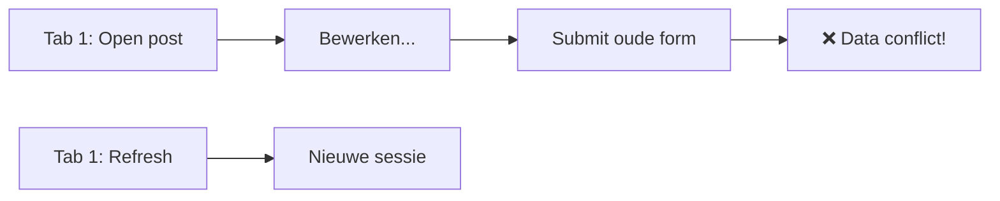
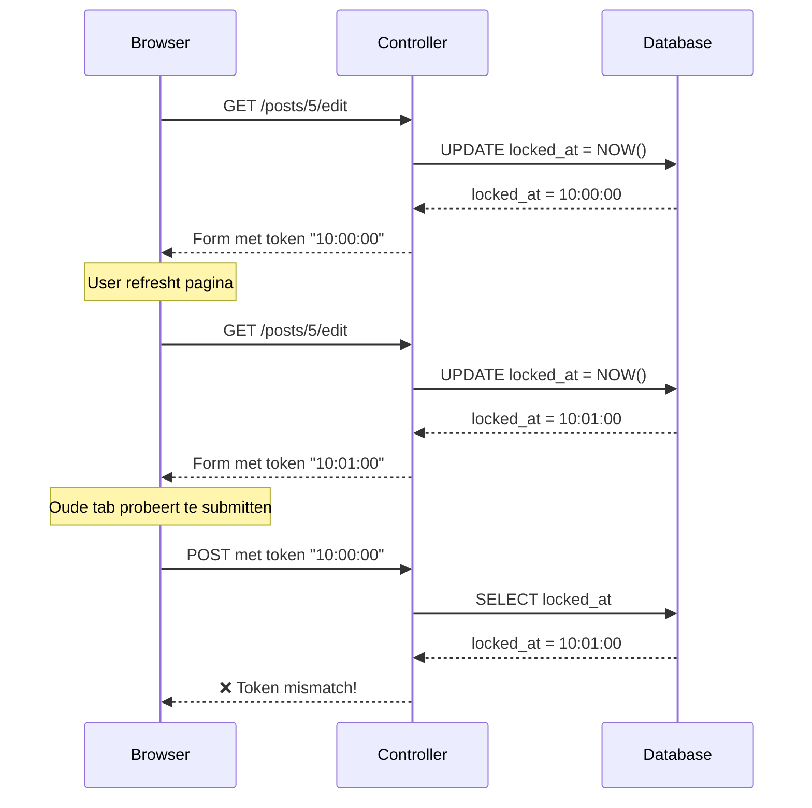

# Lock Token Refresh Validatie

> [!info] Doel
> Voorkom dat oude formulieren (na browser refresh) nog opgeslagen kunnen worden.

---

## Het Probleem



Zonder validatie zou een oude tab nog kunnen opslaan na refresh.

---

## De Oplossing: Lock Token

Gebruik de `locked_at` timestamp als verificatie token:

| Stap | locked_at in DB | Token in Form |
|------|-----------------|---------------|
| Open post | 10:00:00 | 10:00:00 |
| Refresh | **10:01:00** | **10:01:00** |
| Oude tab submit | 10:01:00 | 10:00:00 ❌ |

**Mismatch = Weigeren**

---

## Implementatie

### 1. View: Hidden field

```php
<!-- post-edit.php -->
<input type="hidden" 
       name="lock_token" 
       value="<?= htmlspecialchars($lockToken) ?>">
```

### 2. Controller edit(): Token meesturen

```php
$lockInfo = $lockService->getLockInfo($id);
$lockToken = $lockInfo['locked_at'] ?? null;

View::render('post-edit.php', [
    // ...
    'lockToken' => $lockToken,
]);
```

### 3. Controller update(): Token verifiëren

```php
// Haal form token op
$formLockToken = trim($_POST['lock_token'] ?? '');

// Haal database token op
$lockInfo = $lockService->getLockInfo($id);
$dbLockToken = $lockInfo['locked_at'] ?? '';

// Vergelijk
if ($formLockToken !== $dbLockToken) {
    Flash::set('error', 'Sessie verlopen (pagina ververst)');
    header('Location: .../edit');
    exit;
}
```

---

## Flow Diagram



---

## Waarom dit werkt

| Eigenschap | Uitleg |
|------------|--------|
| **Geen extra DB velden** | Hergebruik van `locked_at` |
| **Automatisch uniek** | Elke page load = nieuwe timestamp |
| **Server-side** | Geen JavaScript nodig |
| **Veilig** | Token kan niet geraden worden |
