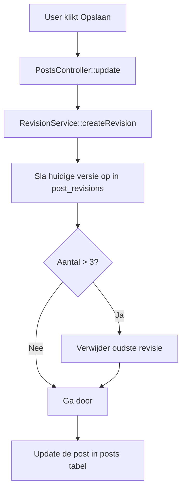

# Revisiebeheer - Implementatie Notities

> [!info] Doel
> Bij elke update van een post wordt de vorige versie opgeslagen.
> Er worden maximaal 3 revisies per post bewaard (oudste vervalt).

---

## Database

Een aparte tabel `post_revisions` die gekoppeld is aan de `posts` tabel.

```sql
CREATE TABLE post_revisions (
    id INT PRIMARY KEY AUTO_INCREMENT,
    post_id INT NOT NULL,           -- Koppeling met post
    title VARCHAR(255),
    content TEXT,
    status VARCHAR(50),
    revision_number INT,            -- Volgnummer (1, 2, 3...)
    created_at DATETIME,
    FOREIGN KEY (post_id) REFERENCES posts(id) ON DELETE CASCADE
);
```

> [!tip] ON DELETE CASCADE
> Als je de hoofd-post verwijdert, worden automatisch alle revisies ook verwijderd. Handig!

---

## MVC Architectuur

| Laag | Bestand | Verantwoordelijkheid |
|------|---------|---------------------|
| **Repository** | `RevisionRepository.php` | CRUD: opslaan, ophalen, tellen, verwijderen van revisies. |
| **Service** | `RevisionService.php` | **Businesslogica**: Max 3 regels, herstel logica. |
| **Controller** | `PostsController.php` | Roept service aan vóór update, toont overzicht. |

---

## Logica: Maximaal 3 Revisies

Deze logica zit in de **Service layer** (`RevisionService.php`).

```php
public function createRevision(int $postId, array $postData) {
    // 1. Sla huidige versie op
    $this->revisions->create($postId, ...);
    
    // 2. Check en handhaaf limiet
    $this->enforceMaxRevisions($postId);
}

private function enforceMaxRevisions(int $postId) {
    // Zolang aantal > 3 is...
    while ($this->revisions->countByPostId($postId) > 3) {
        // ...haal oudste op...
        $oldest = $this->revisions->getOldest($postId);
        // ...en verwijder die.
        $this->revisions->delete($oldest['id']);
    }
}
```

---

## Flow: Post Updaten



---

## Logica: Herstellen

Bij herstellen gebeuren er 2 dingen:
1. De **huidige** versie wordt eerst nog opgeslagen als revisie (zodat je undo kunt doen).
2. De post wordt overschreven met de data van de revisie.
3. **Belangrijk:** De *slug* blijft ongewijzigd (anders breken URL's).

```php
public function restoreRevision(int $revisionId) {
    // 1. Haal revisie en huidige post op
    $revision = $this->revisions->find($revisionId);
    $post = $this->posts->find($revision['post_id']);
    
    // 2. Sla HUIDIGE staat op als nieuwe revisie (veiligheid!)
    $this->createRevision($post['id'], $post);
    
    // 3. Overschrijf post met revisie data (behalve slug)
    $this->posts->update(
        $post['id'],
        $revision['title'],
        $revision['content'],
        ...
    );
}
```
